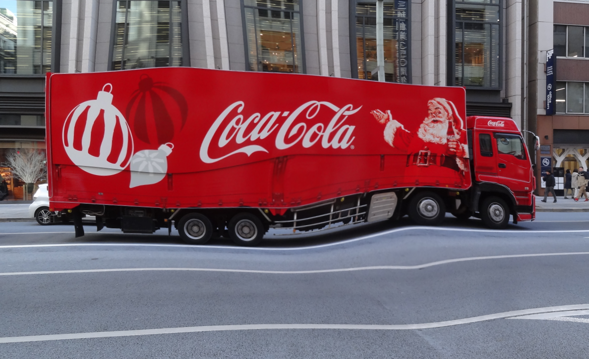

<h2> Barrel-Image-Distortion-Tool (2024/06/18)</h2>

 
<a href="#1">1, Seeing Is Believing</a> 
<a href="#2">2, Run BarrelImageDistorter</a> 
 
This is a simple python class <a href="./BarrelImageDistorter.py">BarrelImageDistorter</a> to distort an image by using 
OpenCV remap.
This is based on the code in the following stackoverflow web-site. 
 
https://stackoverflow.com/questions/59776772/python-opencv-how-to-apply-radial-barrel-distortion
 
 
This ImageDistorter runs on Python 3.8 or later version. Please install opencv-python to your Python development enviroment.   
This tool can be used to augment the image and mask files to train an image segmentation model.
 
<h3> 
<a id="1">1. Seeing Is Believing</a>
</h3>

<b>BarrelImageDistorterDemo</b> 
Please run the following command with a configuration file <b>demo_distortion.config</b>. 
<pre>
>python BarrelImageDistorterDemo.py ./demo_distortion.config
</pre>
, where demo_distortion.config file is the following. 
<pre>
; demo_distortion.config
; 2024/06/18 (C) antillia.com

[barrdistortion]
radius     = 0.3
amount     = 0.3
centers    = [(0.3, 0.3), (0.5, 0.5), (0.7, 0.7)]
images_dir ="./meshed_images"
output_dir ="./distorted_meshed_images"
</pre>

<b>Input image</b> 
<table>
<tr>
<td>

</td>
</tr>
</table>
 
<b>Barrel distorted images</b> 
The yellow circles in the following images indicate the center of the barrel distortion. 
In the configration file above, there are three centers define.  
<pre>
centers    = [(0.3, 0.3), (0.5, 0.5), (0.7, 0.7)]
</pre>
<table>
<tr>
<td>

</td>
<td>

</td>
<td>

</td>
</tr>
</table>

 

<h3>
<a id="2">2. Run BarrelImageDistorter</a>
</h3> 
To run ImageDistorter, please specify a <i>distortion.config</i> as a command-line parameter as shown below.
<pre>
>python BarrelImageDistorter distortion.config
</pre>
, where distortion.config file is the following. 
<pre>
; distortion.config
; 2024/06/18 (C) antillia.com

[barrdistortion]
radius     = 0.3
amount     = 0.3
centers    = [(0.3, 0.3), (0.5, 0.5), (0.7, 0.7)]
images_dir ="./images"
output_dir ="./distorted_images"
</pre>

By running the command above, each image in images_dir will be read, distorted by the parameters in [distortion] section, and
saved to output_dir. 

 
<b>Input images</b>  
 
 
<b>Distorted images</b> 
 

 
<b>Enlarged sample images</b> 
coca-cola  
<table>
<tr>
<td>

</td>
<td>

</td>
<td>

</td>
</tr>
</table>
 
cranes  
<table>
<tr>
<td>

</td>
<td>

</td>
<td>

</td>
</tr>
</table>
 

koban  
<table>
<tr>
<td>

</td>
<td>

</td>
<td>

</td>
</tr>
</table>
 

MeshedNioh  
<table>
<tr>
<td>

</td>
<td>

</td>
<td>

</td>
</tr>
</table>
 
MeshedPicture  
<table>
<tr>
<td>

</td>
<td>

</td>
<td>

</td>
</tr>
</table>

 
road_signs  
<table>
<tr>
<td>

</td>
<td>

</td>
<td>

</td>
</tr>
</table>

