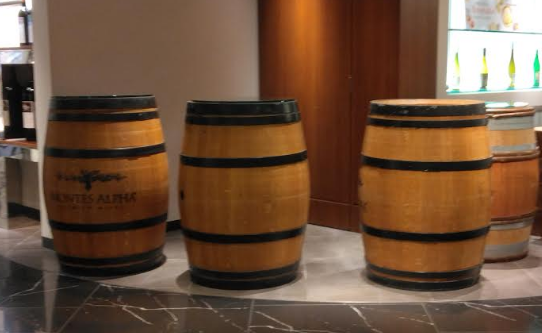
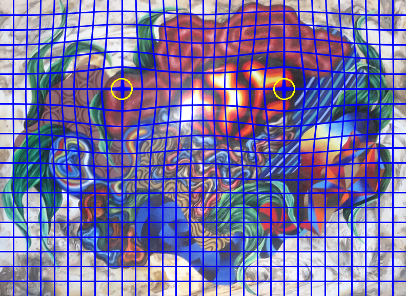
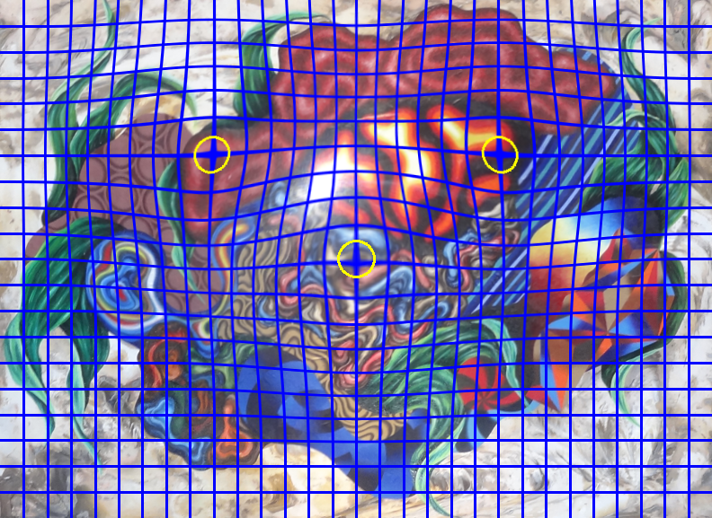
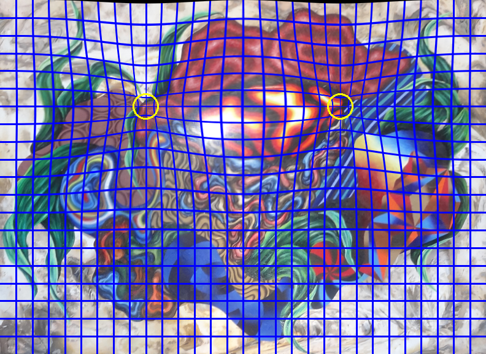

<h2> Barrel-Image-Distortion-Tool (Updated: 2024/09/16)</h2>

 

  

<a href="#1">1. Seeing Is Believing</a> 
<a href="#2">2. Run BarrelImageDistorter</a> 
<a href="#3">3. ImageMaskAugmentor </a> 

 
This is a simple python class <a href="./BarrelImageDistorter.py">BarrelImageDistorter</a> to distort an image by using 
OpenCV remap.
This is based on the code in the following stackoverflow web-site. 
 
https://stackoverflow.com/questions/59776772/python-opencv-how-to-apply-radial-barrel-distortion
 
 
This ImageDistorter runs on Python 3.8 or later version. Please install opencv-python to your Python development enviroment.   
This tool can be used to augment the image and mask files to train an image segmentation model.
  
<table>
<tr>
<th>Barrel-Distortion</th>
<th>Pincushion-Distortion</th>
</tr>
<tr>
<td>

</td>
<td>

</td>

</tr>
</table>

  

 
<h3> 
<a id="1">1. Seeing Is Believing</a>
</h3>
<b>Input image</b> 
<table>
<tr>
<td>

</td>
</tr>
</table>

<h3>1.1 Barrel Distortion</h3>
Please run the following command with a configuration file <b>demo_distortion.config</b>. 
<pre>
>python BarrelImageDistorterDemo.py ./demo_distortion.config
</pre>
, where demo_distortion.config file is the following. 
<pre>
; demo_distortion.config
; 2024/06/18 (C) antillia.com

[barrdistortion]
radius     = 0.3
amount     = 0.3
;centers    = [(0.3, 0.3), (0.5, 0.5), (0.7, 0.7)]
centers    =  [(0.3, 0.3), (0.7, 0.3), (0.5, 0.5), (0.3, 0.7), (0.7, 0.7)]
images_dir ="./meshed_images"
output_dir ="./distorted_meshed_images"

</pre>

 
<b>Barrel distorted images</b> 
The yellow circles in the following images indicate the center of the barrel distortion. 
In the configration file above, there are three centers defined, and three distorted images will be
generated by this BarrelImageDistorter as shown below. 
<pre>
centers    =  [(0.3, 0.3), (0.7, 0.3), (0.5, 0.5), (0.3, 0.7), (0.7, 0.7)]
</pre>
<b>Barrel distortion</b> 
<table>
<tr>
<td>

</td>
<td>

</td>
<td>

</td>
</tr>
<tr>
<td>

</td>
<td>

</td>

</tr>
</table>

 
<h3>1.2 Pincushion Distortion </h3>
If you would like try a pincushion distortion, please run the following command. 
<pre>
>python BarrelImageDistorterDemo.py ./demo_distortion2.config
</pre>
, where demo_distortion2.config file is the following. 
<pre>
; demo_distortion2.config
; 2024/06/27 Updated (C) antillia.com

[barrdistortion]
radius     = 0.3
amount     = -0.3
;centers    = [(0.3, 0.3), (0.5, 0.5), (0.7, 0.7)]
centers    =  [(0.3, 0.3), (0.7, 0.3), (0.5, 0.5), (0.3, 0.7), (0.7, 0.7)]
images_dir ="./meshed_images"
output_dir ="./distorted_meshed_images2"
</pre>
<b>Pincushion distorted images</b> 
<table>
<tr>
<td>

</td>
<td>

</td>
<td>

</td>
</tr>
<tr>
<td>

</td>
<td>

</td>

</tr>
</table>

 

<h3>
<a id="2">2. Run BarrelImageDistorter</a>
</h3> 
To run ImageDistorter, please specify a <i>distortion.config</i> as a command-line parameter as shown below.
<pre>
>python BarrelImageDistorter distortion.config
</pre>
, where distortion.config file is the following. 
<pre>
; distortion.config
; 2024/06/18 (C) antillia.com

[barrdistortion]
radius     = 0.3
amount     = 0.3
centers    = [(0.3, 0.3), (0.5, 0.5), (0.7, 0.7)]
images_dir ="./images"
output_dir ="./distorted_images"
</pre>

By running the command above, each image in images_dir will be read, distorted by the parameters in [distortion] section, and
saved to output_dir. 

 
<b>Input images</b>  
 
 
<b>Distorted images</b> 
 

 
<b>Enlarged sample images</b> 
coca-cola  
<table>
<tr>
<td>

</td>
<td>

</td>
<td>

</td>
</tr>
</table>
 
cranes  
<table>
<tr>
<td>

</td>
<td>

</td>
<td>

</td>
</tr>
</table>
 

koban  
<table>
<tr>
<td>

</td>
<td>

</td>
<td>

</td>
</tr>
</table>
 

MeshedNioh  
<table>
<tr>
<td>

</td>
<td>

</td>
<td>

</td>
</tr>
</table>
 
picture  
<table>
<tr>
<td>

</td>
<td>

</td>
<td>

</td>
</tr>
</table>

 
road_signs  
<table>
<tr>
<td>

</td>
<td>

</td>
<td>

</td>
</tr>
</table>

<h3>
<a id="3">3. ImageMaskAugmentor</a>
</h3> 
By using the barrel image distortion algorithm, we created a tiny offline <a href="ImageMaskAugmentor.py">ImageMaskAugmentor Tool.</a>.
 
To run the augmentation tool, please specify an <i>augmentor.config</i> as a command-line parameter as shown below.
<pre>
>python ImageMaskAugmentor.py augmentor.config
</pre>
, where augmentor.config file is the following. 
<pre>
; augmentor.config
; 2024/06/20 (C) antillia.com

[augmentor]
images_dir = "./BCSS-Breast-Cancer-mini-dataset/images/"
masks_dir  = "./BCSS-Breast-Cancer-mini-dataset/masks/"
output_dir = "./Augmented-BCSS-Breast-Cancer-mini-dataset/"
      
radius     = 0.3
amount     = 0.5
centers    = [(0.3, 0.3), (0.5, 0.5), (0.7, 0.7)]
</pre>
The original images files in "./BCSS-Breast-Cancer-mini-dataset/images/" and mask files in "./BCSS-Breast-Cancer-mini-dataset/masks/"
have been taken from <a href="https://github.com/PathologyDataScience/BCSS">
<b>Breast Cancer Semantic Segmentation (BCSS) dataset.</b>
 </a>
 
On that dataset, please see aslo our github repository <a href="https://github.com/sarah-antillia/Tiled-ImageMask-Dataset-Breast-Cancer">Tiled-ImageMask-Dataset-Breast-Cancer</a>.
 

<b>Input images</b>  
 
 
<b>Input mask</b> 
 

 
<b>Augmented images</b> 
 
 
<b>Augmented masks</b> 
 
 

<h3> Dataset Citation</h3>
The original dataset used here has been taken from the following github repository. 

<a href="https://github.com/PathologyDataScience/BCSS">
Breast Cancer Semantic Segmentation (BCSS) dataset
</a>
 
 
On detail of this dataset, please refer to the following paper. 

<a href="https://academic.oup.com/bioinformatics/article/35/18/3461/5307750?login=false">
 

<b>Structured crowdsourcing enables convolutional segmentation of histology images</b> 
</a> 
Bioinformatics, Volume 35, Issue 18, September 2019, Pages 3461–3467,  
https://doi.org/10.1093/bioinformatics/btz083 
Published: 06 February 2019 

Mohamed Amgad, Habiba Elfandy, Hagar Hussein, Lamees A Atteya, Mai A T Elsebaie, Lamia S Abo Elnasr,  
Rokia A Sakr, Hazem S E Salem, Ahmed F Ismail, Anas M Saad, Joumana Ahmed, Maha A T Elsebaie,  
Mustafijur Rahman, Inas A Ruhban, Nada M Elgazar, Yahya Alagha, Mohamed H Osman, Ahmed M Alhusseiny,  
Mariam M Khalaf, Abo-Alela F Younes, Ali Abdulkarim, Duaa M Younes, Ahmed M Gadallah, Ahmad M Elkashash,  
Salma Y Fala, Basma M Zaki, Jonathan Beezley, Deepak R Chittajallu, David Manthey, 
David A Gutman, Lee A D Cooper 

 
<b>Dataset Licensing</b> 
This dataset itself is licensed under a CC0 1.0 Universal (CC0 1.0) license. 

 
